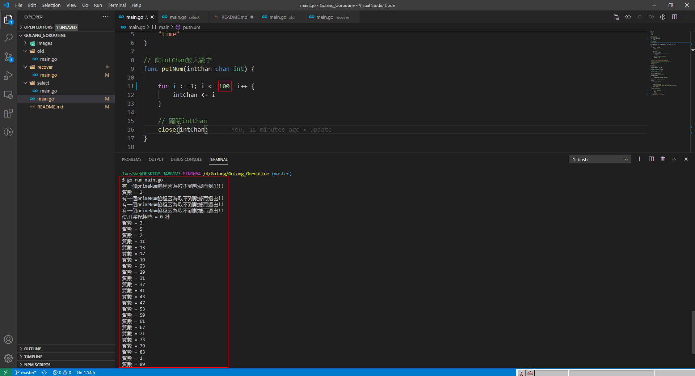
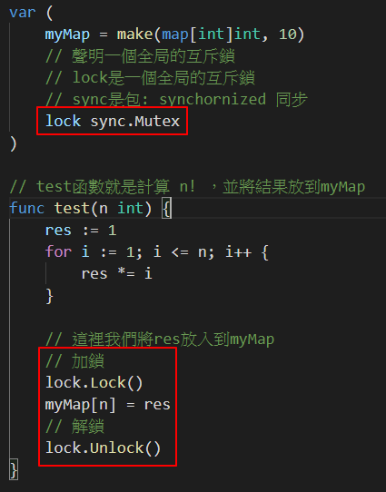
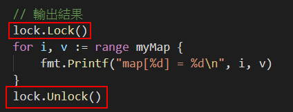

# Golang_Goroutine

# 判斷質數的例子

使用協程的方式，與使用傳統方式的時間比較
結果時間差了4倍，協程可以有效的利用cpu多核的特性

先試跑0-100的質數


測試使用協程及未使用協程所差的時間


# 管道
管道可以聲明為只讀或只寫

1. 默認的情況下，管道是雙向的

2. 聲明為只寫

```go
var chan2 chan<- int
chan2 = make(chan int,3)
chan2<-20
// num := <-chan2 // 這行會報錯，因為不可讀出
```

3. 聲明為只讀

```go
var chan3 <-chan int
num2 := <-chan3
// chan3 <-30 // 這行會報錯，因為不可寫入
```

# 使用Select可以解決從管道取數據的阻塞問題

```shell
# 請查看./select/main.go的例子
```


# 使用defer + recover 可以捕獲拋出的panic

```shell
# 請查看./recover/main.go的例子
```


# 互斥鎖

```shell
# 請查看./mutex/main.go的例子
```

## 不同goroutine之間如何通訊

1. 全局變量加鎖同步
2. channel

**如果沒有對全局變量myMap加鎖的話，會出現資源爭奪的問題，代碼會出現出誤，提示concurrent map writes**

```shell
# 查看是否有資源競爭的問題
go build -race main.go
./main.exe
```


## 加鎖





## 最後執行結果


